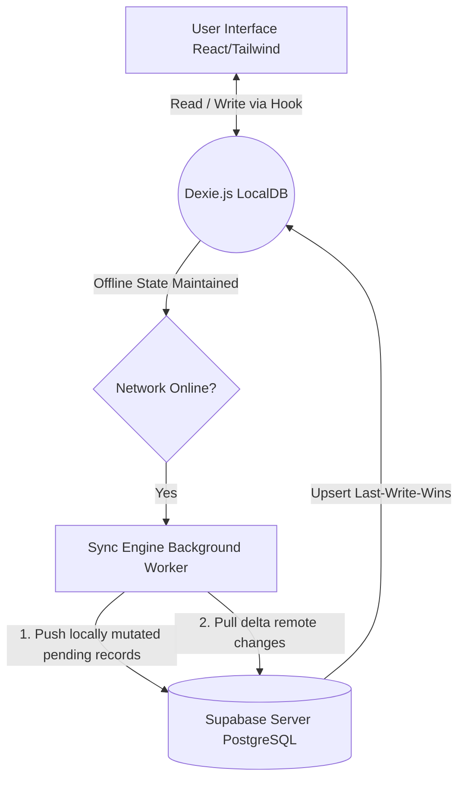

# Hardware ERP Architecture & System Design

## 1. Database Schema

The core schema is designed for an offline-first architecture with conflict-free synchronization capabilities. Each entity uses UUIDv4 for primary keys to allow safe client-side generation and conflict avoidance.

### Core Entities

**Users (Supabase Auth Extension)**
- `id`: UUID (Primary Key, matches `auth.users.id`)
- `name`: String
- `email`: String (Unique)
- `role`: Enum ('Owner', 'Manager', 'Staff')
- `created_at`: Timestamp

**Diaries (Customer Groupings/Ledgers)**
- `id`: UUID (PK)
- `name`: String
- `description`: Text
- `created_by`: UUID (FK -> Users)
- `created_at`: Timestamp

**Customers (Accounts)**
- `id`: UUID (PK)
- `diary_id`: UUID (FK -> Diaries)
- `name`: String
- `phone`: String
- `address`: Text
- `credit_limit`: Decimal
- `sync_status`: Enum (Local only: 'synced', 'pending_insert', 'pending_update', 'pending_delete')
- `updated_at`: Timestamp (Unix ms, for sync resolution)
- `created_at`: Timestamp

**Transactions (Debits / Sales)**
- `id`: UUID (PK)
- `customer_id`: UUID (FK -> Customers)
- `recorded_by`: UUID (FK -> Users)
- `total_amount`: Decimal
- `date`: Date
- `items`: JSONB (Array of `{ material, qty, unit, rate }`)
- `sync_status`: Enum (Local only)
- `updated_at`: Timestamp
- `created_at`: Timestamp

**Payments (Credits / Collections)**
- `id`: UUID (PK)
- `customer_id`: UUID (FK -> Customers)
- `recorded_by`: UUID (FK -> Users)
- `amount`: Decimal
- `payment_mode`: Enum ('Cash', 'UPI', 'Bank Transfer', 'Cheque')
- `reference_notes`: Text
- `date`: Date
- `sync_status`: Enum (Local only)
- `updated_at`: Timestamp
- `created_at`: Timestamp

## 2. Entity Relationships

*   **Users (1) to (M) Diaries**: A user can create multiple diaries (e.g., categorizing ledgers by year or location).
*   **Diaries (1) to (M) Customers**: Each customer belongs to one specific diary grouping.
*   **Customers (1) to (M) Transactions**: A customer can have many sales transactions (debits).
*   **Customers (1) to (M) Payments**: A customer can have multiple incoming payments (credits).
*   **Transactions / Payments**: Tie back to the User (staff) who recorded them for auditing.

*Balance Calculation logic*: Outstanding Balance is dynamically calculated as `SUM(Transactions.total_amount) - SUM(Payments.amount)` across both local (Dexie.js) and remote (Supabase) projections.

## 3. Supabase Implementation Strategy

- **Row Level Security (RLS)** is strictly enforced on all tables.
- **Tenant Isolation**: Depending on requirements, RLS policies will ensure users map strictly to their respective shop/company via a mapping table if scaling to multi-tenant.
- **Views**: Postgres Views (e.g., `view_customer_balances`) are utilized on the server side to compute aggregates efficiently, preventing the need to fetch raw historical rows for metric calculations.
- **Offline IDs**: Identifiers (UUIDs) are generated client-side via `crypto.randomUUID()` and ingested by Supabase.

## 4. Navigation Structure (Information Architecture)

The application follows a flat, mobile-friendly navigation tree optimized for fast point-of-sale data entry:

1. **Dashboard** (Home)
   - Real-time aggregate metrics (Outstanding, Collections, Sales).
   - Quick routing to high-frequency actions.
2. **Customers Menu**
   - High-performance indexed list view with fuzzy search.
   - Entry point for new customer onboarding.
   - Navigates down to individual **Customer Ledgers** (detailed transaction/payment mapping).
3. **Quick Sale (New Entry)**
   - Specialized complex form allowing multi-item invoice entry.
   - Built-in "Instant Cash Collection" allowing simultaneous creation of a Transaction and a Payment.
4. **Credit Payment**
   - Streamlined intake flow for liquidating customer debt.
5. **Logs & Statements**
   - Global chronological views of `PaymentHistory` and `InventoryLogs`.

## 5. Data Flow Diagram (Sync & Offline-First Strategy)

**Sync Conflict Resolution Strategy**:
1. **Local Truth First**: Standard CRUD operations (Create, Edit, Delete) NEVER block on network queues. They write immediately to `Dexie.js`.
2. **State Flags**: Every record maintains a transactional state: `sync_status` (`pending_insert`, `pending_update`, `pending_delete`, `synced`).
3. **Pushing State**: When online connectivity is detected, the engine scoops all records where `sync_status != 'synced'` and pushes them. Upon successful confirmation (HTTP 20X) or explicit duplicate conflict, flags degrade to `synced`.
4. **Pulling State**: Background sync retrieves state from Supabase. Any incoming server rows update the local `Dexie.js` dataset safely via Time-Based Resolution (Last-Write-Wins using `updated_at`).
